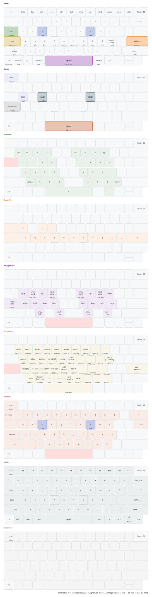

# dotfiles

Personal macOS development environment — clone and run `install.sh` to get a fully configured machine.

## Quick Start

```bash
git clone https://github.com/kamykaze/dotfiles.git ~/personal/projects/dotfiles
cd ~/personal/projects/dotfiles
less SETUP_NOTES.md   # read this first — install.sh will prompt you to anyway
./install.sh
bash scripts/macos.sh # applies system preferences; not part of install.sh
```

`install.sh` will:

- Install Xcode Command Line Tools (if missing)
- Install Homebrew and all packages from `Brewfile`
- Create all dotfile symlinks (`_*` → `~/.`) — existing non-symlinks are skipped
- Check VS Code config (Settings Sync owns it; extensions come from the Brewfile)
- Install the git hooks and wire up the Kanata keyboard LaunchAgent
- Switch this repo's remote from HTTPS to SSH at the end

It opens with a preflight summary and waits for you to type `yes`. Use
`./install.sh --yes` to skip that on re-runs.

It does **not** apply macOS system preferences — run `scripts/macos.sh` for that.
See [SETUP_NOTES.md](SETUP_NOTES.md) for the full ordering and the manual steps
(SSH keys, app licenses, first-time app setup).

---

## How It Works

### File Naming Convention

Files prefixed with `_` are symlinked into `$HOME` with the prefix replaced by `.`:

```text
_zshrc        →  ~/.zshrc
_gitconfig    →  ~/.gitconfig
_configs/     →  ~/.configs/
```

### Scripts

| Script | Purpose |
| --- | --- |
| `install.sh` | Main entry point — delegates to all scripts below |
| `scripts/symlinks.sh` | Creates all dotfile symlinks |
| `scripts/homebrew.sh` | Installs Homebrew and runs Brewfile |
| `scripts/macos.sh` | Applies macOS system preferences via `defaults write` |
| `scripts/karabiner-driver.sh` | Pins the Karabiner virtual HID driver to the version kanata requires |
| `scripts/launchagents.sh` | Installs launchd services (Kanata auto-start) |
| `scripts/sync.sh` | Exports configs from apps that own their files (run daily via LaunchAgent). Skips macOS prefs until `macos.sh` has been applied here; `--force` overrides |
| `scripts/keymap-diagram.sh` | Redraws the keyboard layer map below from `_configs/kanata.kbd` + the BetterTouchTool preset |

All scripts are idempotent — safe to run multiple times.

---

## Key Configurations

### Shell & Terminal

- `_zshrc` — Zsh configuration (primary shell)

### Editor

- `_vimrc` — Full Vim config with Pathogen plugin management, focused on web development (HTML/CSS/JS, Python/Django)
- `_vimrc_bare` — Minimal Vim config without plugins
- `_vim/` — Vim plugins (git submodules via Pathogen)

### Git

- `_gitconfig` — Git aliases and settings
- `_gitignore` — Global ignore patterns

### Keyboard

- `_configs/kanata.kbd` — [Kanata](https://github.com/jtroo/kanata) keyboard remapping:
  - Home row modifiers (ASDF / JKL;)
  - Layers: numbers, navigation, symbols, shortcuts, mirror, plain, disabled
- `qmk_mappings/` — QMK firmware layouts for physical keyboards

#### Layer map



Reading a key: **centre** is tap, **top** is double-tap, **bottom** is hold — or
the layer it switches to, underlined. Window management draws as an icon: the
outline is the screen, the shaded part is where the window lands, and a broken
outline is a space you can't currently see. Every layer shows only the keys it
changes; the base layer greys in the ones it leaves alone, so the trigger keys
can be found against a familiar keyboard. On the disabled layer, every key is
drawn with a "no action" mark. The `f` and `j` keys are outlined more heavily on
every layer, so you can still count across from the home keys once the legends
stop looking like a keyboard. Layer names are links — click one to jump to that
layer's diagram. Each layer has its own colour, and the key
that switches to it carries that colour on every other layer. Only keys a layer
actually changes are tinted, so the coloured keys are the layer. Dashed keys
(`fn`, Touch ID) are hardware macOS never reports, so kanata cannot see them;
`fn` is held for voice dictation. A key showing a plain chord (`hyper+1`) is one
kanata fires and nothing in BetterTouchTool answers.

Mappings whose intent isn't obvious from the chord are named in `kanata.kbd`
itself, with `;; :label lalt+left = prev word` comments that kanata ignores and
the diagram reads.

Regenerate it with `scripts/keymap-diagram.sh` after changing the layers or the
BTT preset — the app names come from the preset, so the picture is only as
current as `bettertouchtool/kam_btt_presets.bttpreset`. The physical layout is
`scripts/keymap-mbp.json`; edit that to draw a different keyboard.

### Applications

- `_configs/vscode-settings.json` / `vscode-keybindings.json` — VS Code settings snapshots (reference only; Settings Sync owns the live files)
- `_configs/vscode-extensions.txt` — VS Code extensions snapshot (the Brewfile installs them)
- `bettertouchtool/` — BetterTouchTool presets (trackpad, keyboard, touchbar)
- `utilities/scripts/chrome-tab-focus.sh` — Focuses Chrome tabs (Gmail, Docs, Sheets, etc.) by URL and title, called by BetterTouchTool shortcuts

### Sensitive Configs

Files with secrets are kept out of the repo. Instead:

- `_configs/*.template` files contain the structure with placeholders like `"token": "YOUR_API_KEY"`
- Real values are stored in **LastPass**
- See [SETUP_NOTES.md](SETUP_NOTES.md) for which LastPass notes to use

---

## Keeping Configs in Sync

Symlinked files (`~/.zshrc`, `~/.gitconfig`, etc.) are always in sync — editing them **is** editing the repo. Just `git commit` when ready.

For apps that own their config files (VS Code extensions, etc.), run:

```bash
./scripts/sync.sh   # copies latest app configs into the repo
git diff            # review changes
git add -p && git commit -m "chore: sync configs"
```

---

## Adding a New Config

See [SETUP_NOTES.md](SETUP_NOTES.md) for the full patterns. Quick summary:

- Config at `~/.*` → copy to `_*`, run `scripts/symlinks.sh`
- Config at `~/Library/...` → copy to `_configs/`, add to `sync.sh` and `symlinks.sh`
- Config at `~/.config/<app>/` → copy to `_config/<app>/`, run `scripts/symlinks.sh`
- New Homebrew app → add to `Brewfile`
- Manual-install app → add to `apps.md`
- Config with secrets → `.template` file only, real values in LastPass
