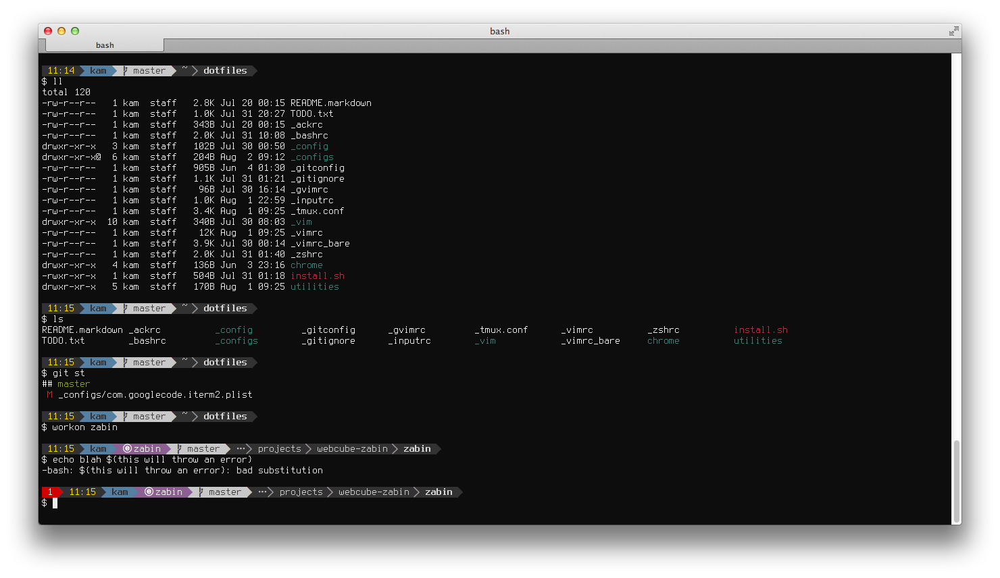

Here are some instructions to get your terminal prompt looking like the following. The main advantages (aside from looking nice) is that powerline only shows segments based on what's applicable (and in vim and tmux, lower priority segments disappear as the window gets smaller).

## Part 1 - Script

1. get python > v2.7 installed (google for this if needed...it's likely you already have python installed)
2. install powerline plugin using a terminal. 

<pre><code>pip install --user git+git://github.com/Lokaltog/powerline</code></pre>

Pay attention to where pip installs powerline. In my case, it was in ~/.local/bin/powerline

If successful, you should see some colored prompt with some funky characters when you run this (don't worry about the unicode characters...they'll be fixed when you install a proper font)

    powerline shell left

If you get a command not found error, add the directory where powerline is located to your PATH environment variable. In my case, I edited my ~/.bashrc file, and added:

    export PATH=$PATH:$HOME/.local/bin 

then saved the file and ran

    source ~/.bashrc 

Aslong as the command runs fine, whether the output looks right or not, you have the python powerline script running...which is a good start.
 

## Part 2 - Terminal Setup

1. Find a suitable font for powerline (or patch your own) here: https://github.com/Lokaltog/powerline-fonts

    Note: not all fonts there work for Mac due to the file type

    I used Inconsolata Dz, which can be downloaded [here](https://github.com/Lokaltog/powerline-fonts/raw/master/InconsolataDz/Inconsolata-dz%20for%20Powerline.otf).

    Once downloaded, double click to open, then click "Install Font"

2. Now, setup your terminal to use the patched font. I highly recommend using [iTerm2](http://www.iterm2.com/#/section/downloads), but if you want to use Terminal, here's how

### Terminal

1. Go to Preferences > Settings, choose a Profile, under Text, click the "Change..." button to pick a new font, select the font you downloaded (e.g.: Inconsolata 14pt)

1. Under the same profile, in Advanced, declare terminal as 'xterm-256color'

1. close the settings window

### iTerm2

The advantages of using iTerm are many, but for powerline, the colors seem to work better, and it allows you to use two different fonts for regular ASCII characters and Unicode characters. That's what I do...I use Terminus for ASCII, and Inconsolata for non-ascii characters (the patched Terminus font I found did not look good)

1. Open Preferences > Profiles > Text, then pick the font(s) you downloaded. I set 'Terminus Medium 14pt' for ASCII, and 'Inconsolata 13pt' w/anti-alias for non-ASCII. Tweaking font size and spacing will give you the best results.

1. under Terminal, make sure to Report Terminal Type as 'xterm-256color'

1. close the settings window

1.By now, you should have noticed the changes in the look of the powerline output. If not, run "powerline shell left" again to check how it will look.

## Part 3 - Bash setup

1. find the powerline source code, or git clone the repository to a location you'd like. In my case, I found the installed package here: ~/.local/lib/python2.7/site-packages/powerline/

2. edit your ~/.bashrc file and add the following

    . {path_to_repo}/bindings/bash/powerline.sh

3. save the file and reload it

    source ~/.bashrc 

You're done...your bash prompt now uses powerline. You can tweak the colors and segments in it with some configuration files. For info on that, see the [documentation](https://powerline.readthedocs.org/en/latest/configuration.html).

Note: the instructions below will get you running powerline, but it won't look exactly like the screenshot, since I've done some color customization of my own. If you'd like to customize, see this [guide](https://powerline.readthedocs.org/en/latest/configuration.html#quick-guide). You can also check out my customizations in [my dotfiles repo](https://github.com/kamykaze/dotfiles/)
